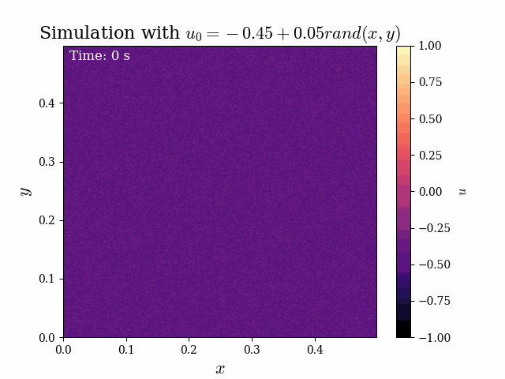
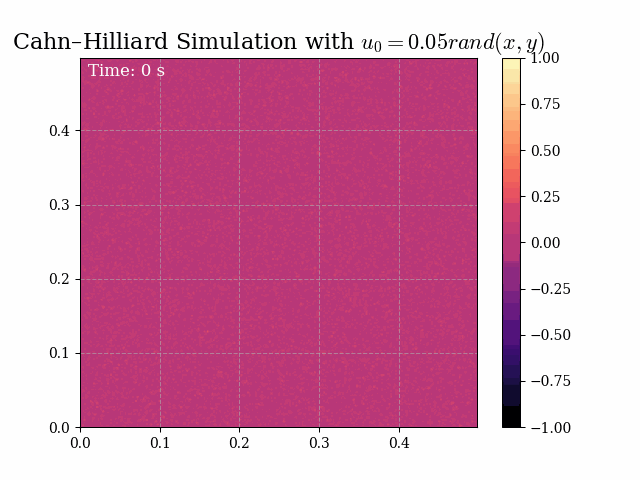

# Cahn-Hilliard Equation Solver

A numerical solver for the **Cahn-Hilliard equation** using the **Discrete Fourier Transform (DFT)** and advanced numerical methods.

## Overview

This project implements a spectral method approach to solve the Cahn-Hilliard equation, a fundamental fourth-order partial differential equation used to model phase separation and spinodal decomposition in binary mixtures.

The solver uses:
- **Discrete Fourier Transform (DFT)** for spatial discretization
- **Advanced numerical integration** techniques
- **Efficient spectral methods** for accurate and stable solutions

## Results

### Phase Separation Visualization

## Features

✅ Spectral method implementation using FFT  
✅ Multiple numerical integration schemes  
✅ Efficient energy-stable algorithms  
✅ Visualization of phase separation dynamics  
✅ Theoretical analysis and validation  

## Technologies

- **Python** - Core implementation
- **NumPy** - Numerical computations
- **SciPy** - FFT and integration methods
- **Matplotlib** - Visualization

## Key Files

- `main.ipynb` - Main implementation and analysis
- `Eirik.ipynb`, `Adrian.ipynb`, `Andreas.ipynb` - Additional implementations and comparisons
- `CahnHilliard_RK_u1.gif`, `CahnHilliard_RK_u2.gif` - Animation results

## Mathematical Background

The Cahn-Hilliard equation describes the evolution of concentration in a binary mixture with conserved dynamics. This solver uses spectral methods which are particularly effective for this equation due to its fourth-order nature.

See the full theoretical derivation and implementation details in `main.ipynb`.
